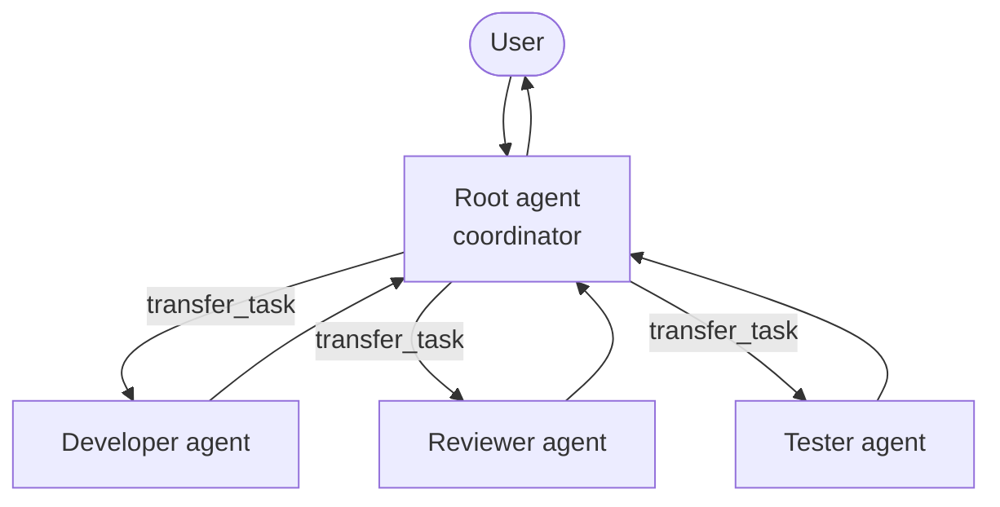

Complex tasks benefit from specialization. Instead of one monolithic agent trying to do everything, you can create a **team** of focused agents — each with its own model, tools, and instructions — and let them coordinate automatically.

## Why multi-agent?

A single agent can struggle with large or diverse tasks. Multi-agent systems let you:

- Give each agent a **narrow, well-defined role** (developer, reviewer, researcher)
- Use **different models** for different jobs — a powerful model for reasoning, a fast cheap model for routine tasks
- **Parallelize work** by running multiple agents concurrently
- Keep **tool permissions minimal** — each agent only gets the tools it actually needs

## The coordinator / sub-agent pattern

The root agent acts as a **coordinator**. When it needs help with a specialized task, it delegates to a sub-agent using the built-in `transfer_task` tool.



<Steps>
  <Step title="User sends a message">
    The user's message goes to the root (coordinator) agent.
  </Step>
  <Step title="Coordinator decides who to delegate to">
    The root agent analyzes the request and selects the most appropriate sub-agent based on each agent's `description`.
  </Step>
  <Step title="Sub-agent handles the task">
    The sub-agent runs its own agentic loop — calling its tools, reasoning, and producing a result.
  </Step>
  <Step title="Result flows back">
    The result is returned to the coordinator, which may delegate further or respond to the user.
  </Step>
</Steps>

## The `sub_agents` field

List the names of sub-agents on the coordinator. Docker Agent automatically provides the `transfer_task` tool:

```yaml dev-team.yaml
agents:
  root:
    model: anthropic/claude-sonnet-4-0
    description: Technical lead coordinating the development team
    instruction: |
      You are a technical lead. Analyze requests and delegate
      to the right specialist. Review results before responding.
    sub_agents: [developer, reviewer, tester]
    toolsets:
      - type: think

  developer:
    model: anthropic/claude-sonnet-4-0
    description: Expert software developer who writes and modifies code
    instruction: |
      You are an expert developer. Write clean, efficient code
      and follow best practices.
    toolsets:
      - type: filesystem
      - type: shell
      - type: think

  reviewer:
    model: openai/gpt-4o
    description: Code review specialist who checks quality and security
    instruction: |
      Review code for quality, security, and maintainability.
      Provide actionable feedback.
    toolsets:
      - type: filesystem

  tester:
    model: openai/gpt-4o
    description: QA engineer who writes tests and validates functionality
    instruction: |
      Write tests and ensure software quality. Run tests
      and report results clearly.
    toolsets:
      - type: shell
      - type: todo
```

<Note>
  The `transfer_task` tool is always auto-approved — no user confirmation needed. This allows seamless, uninterrupted delegation between agents.
</Note>

## Running a multi-agent config

```bash
# Launch the coordinator (root agent)
docker agent run dev-team.yaml

# Launch a specific agent directly
docker agent run dev-team.yaml -a developer
```

## Sequential vs. parallel delegation

<Tabs>
  <Tab title="Sequential (transfer_task)">
    `transfer_task` is the default delegation mechanism. The coordinator waits for the sub-agent to finish before continuing. Best when the result of one task determines what happens next.

    ```yaml
    sub_agents: [researcher, writer]
    toolsets:
      - type: think
    # transfer_task is automatically provided
    ```
  </Tab>
  <Tab title="Parallel (background_agents)">
    Add the `background_agents` toolset to fan out work to multiple agents simultaneously. Best for independent tasks that can run at the same time.

    ```yaml
    sub_agents: [researcher, analyst, writer]
    toolsets:
      - type: think
      - type: background_agents
    ```

    The coordinator can then:
    1. Dispatch tasks with `run_background_agent` — returns a task ID immediately
    2. Monitor progress with `list_background_agents`
    3. Read results with `view_background_agent(task_id="...")`
    4. Cancel tasks with `stop_background_agent` if no longer needed
  </Tab>
</Tabs>

## The handoff tool

For delegation to **remote** agents (running as A2A servers), use the `handoff` toolset instead of `sub_agents`:

```yaml agent.yaml
agents:
  root:
    model: anthropic/claude-sonnet-4-0
    instruction: Coordinate tasks across remote services.
    toolsets:
      - type: handoff
    handoffs:
      - remote-analyst

  remote-analyst:
    model: openai/gpt-4o
    # ... served by a separate docker agent serve a2a process
```

See [A2A](/features/a2a) for the full remote agent protocol.

## Multi-model teams

A key advantage of multi-agent systems is using the best model for each role. Use named models to keep configs readable:

```yaml multi-code.yaml
models:
  gpt4o:
    provider: openai
    model: gpt-4o

  opus:
    provider: anthropic
    model: claude-opus-4-0
    max_tokens: 32000

agents:
  root:
    model: opus           # powerful model for coordination
    description: Senior technical lead
    sub_agents: [web, golang]

  web:
    model: gpt4o          # cost-effective for focused tasks
    description: Expert frontend coder
    toolsets:
      - type: shell
      - type: filesystem
      - type: todo

  golang:
    model: gpt4o
    description: Expert Go backend coder
    toolsets:
      - type: shell
      - type: filesystem
      - type: todo
```

## Shared tools

Some toolsets can be shared across agents so they all read and write the same state. This is useful for coordinated task tracking:

```yaml agent.yaml
toolsets:
  - type: todo
    shared: true  # all agents see the same todo list
  - type: memory
    path: ./shared.db  # all agents write to the same database
```

## Best practices

- **Keep agents focused** — each agent should have a clear, narrow role
- **Write clear descriptions** — the coordinator relies on `description` to choose who to delegate to
- **Give minimal tools** — only give each agent the tools it needs for its specific job
- **Give the coordinator the `think` tool** — this lets it reason carefully about delegation decisions
- **Match model to role** — use capable models for complex reasoning, fast/cheap models for routine tasks

## Next steps

<CardGroup cols={2}>
  <Card title="Background agents" icon="play" href="/tools/background-agents">
    Dispatch work to sub-agents concurrently.
  </Card>
  <Card title="Handoff tool" icon="arrow-right" href="/tools/handoff">
    Delegate to remote agents via A2A.
  </Card>
  <Card title="A2A protocol" icon="network-wired" href="/features/a2a">
    Interoperate with other agent frameworks.
  </Card>
  <Card title="Agent configuration reference" icon="gear" href="/configuration/agents">
    Full reference for all agent config fields.
  </Card>
</CardGroup>
